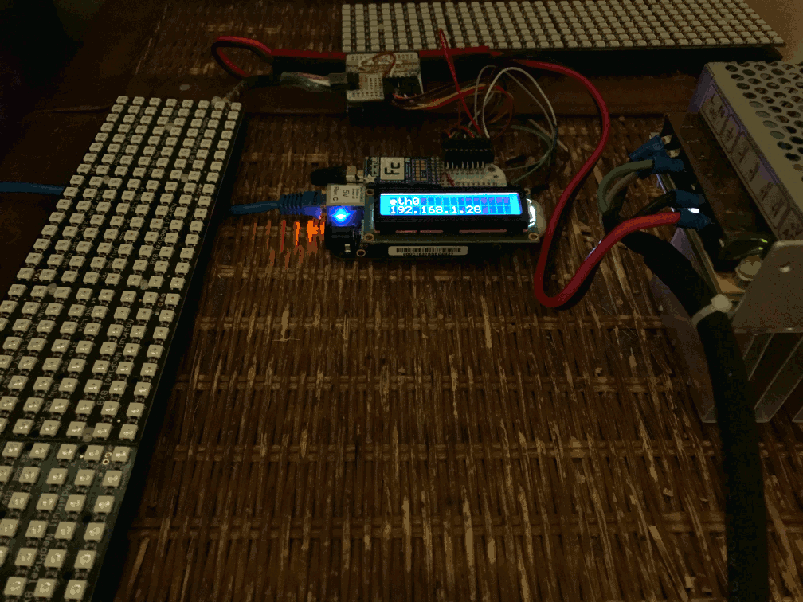
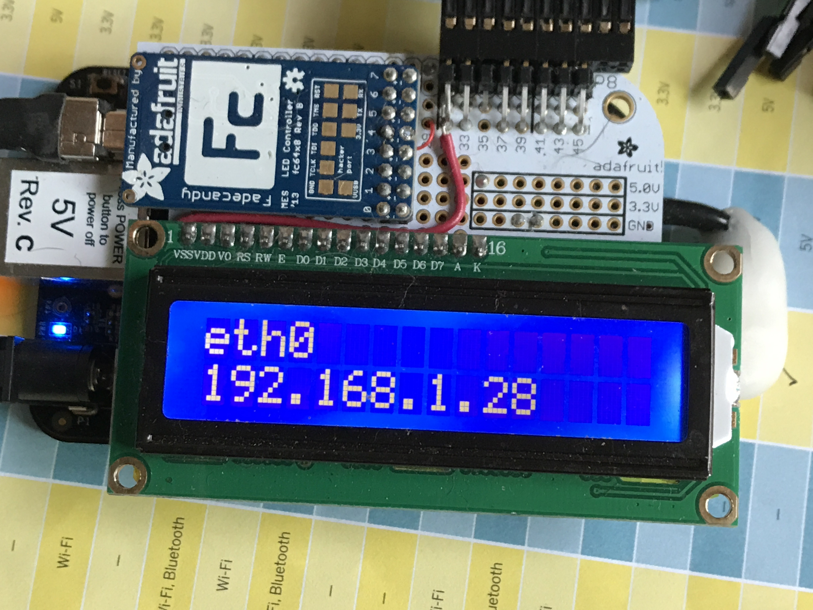

# InternetSkyLight

A skylight you can install in your internets.



(See [32bits.io](https://32bits.io/#/internet-skylight/) for a high-level overview of this project.)

This package provides software to control a fadecandy or other [open pixel controller](http://openpixelcontrol.org/) server to simulate daylight intensity
over time and indicate weather conditions using light colour.

```
usage: skylight [-h] [--frame-rate FRAME_RATE] --city CITY [--verbose]
                [--show-daylight-chart] [--opc-dont-connect]
                [--brightness [0.0 - 1.0]] [--channel CHANNEL]
                [--stride STRIDE] [--pixel-count PIXEL_COUNT]
                [--address ADDRESS] [-p PORT] [--opc-debug]
                [--interface INTERFACE] [--wukey WUKEY] [--weather WEATHER]
                {hypertime,realtime} ...

Open Pixel Controller client providing contextual lighting effects.

positional arguments:
  {hypertime,realtime}  Clock Modes
    hypertime           Clock that can tick at an accelerated rate.
    realtime            Uses system time.

optional arguments:
  -h, --help            show this help message and exit
  --frame-rate FRAME_RATE
                        Frames-per-second to run the sky simulation at.
  --interface INTERFACE
                        The interface to report the address for.

Ephemeris options:
  --city CITY           A city used to lookup ephemeris values and to retrieve
                        current weather conditions.

debug options:
  --verbose, -v         Spew debug stuff.
  --show-daylight-chart, -D
                        Open a window showing a plot of the daylight curve in-
                        use.
  --opc-dont-connect, -X
                        Skip trying to connect to an OPC server. Allows
                        testing other parts of the skylight without actually
                        running the LEDs.

Pixel Options:
  --brightness [0.0 - 1.0], -b [0.0 - 1.0]
                        Maximum brightness of any given pixel.
  --channel CHANNEL     OPC channel to use.
  --stride STRIDE       Number of pixels in a row for the attached matrix
  --pixel-count PIXEL_COUNT
                        Total number of pixels in the attached matrix

OPC options:
  --address ADDRESS     IP address to connect to.
  -p PORT, --port PORT  TCP port to connect to OPC server on.
  --opc-debug           Emit verbose logs from the OPC client.

weather options:
  --wukey WUKEY         API key for the weather underground
  --weather WEATHER     Fake weather conditions for testing.

```

## Hardware

* BeagleBone running Debian linux
* AdaFruit fadecandy
* RGB or RGBW LED arrays or strips
* A big power supply for your LEDs

Simply hook the fadecandy up to the BeagleBone and the pixels up to the fadecandy
and then install this software as a service on the BeagleBone (see below).

## BeagleBone

Follow setup instructions for the [BeagleBone Green Wifi](https://beagleboard.org/green-wireless/)
or [BeagleBone Black](http://beagleboard.org/black) running Debian Jessie.

> From this point we assume you have installed Debian, have a working internet connection,
> and have terminal access to your BeagleBone.

    pip install pyephem, numpy
    mkdir /github
    cd /github
    git clone https://github.com/scottdarch/InternetSkyLight.git
    git clone https://github.com/scanlime/fadecandy.git
    cd fadecandy/server
    make submodules
    make

> Note you may need to `pip install requests` but the latest versions of
> Debian appear to have this pre-installed.

### Time

Since the skylight is all about using time to simulate daylight you'll have to
set the BeagleBone's system clock accurately. The best way is to install NTP services:

```
sudo apt-get update
sudo apt-get -y install libopts25 ntpdate ntp
```
Make sure to setup `/etc/localtime` as a symlink to your local timezone under `/usr/share/zoneinfo/[region]`

If you want to run the skylight offline you'll need to add a hardware clock to your
BeagleBone. See [this AdaFruit article](https://learn.adafruit.com/adding-a-real-time-clock-to-beaglebone-black/set-rtc-time)
for a tutorial.

### Install Services

This section will walk you through setting up the [fadecandy](https://github.com/scanlime/fadecandy) server and the internet
skylight controller as linux services.

#### /lib/systemd/system/fcserver.service

Create this file and add the following to it:

    [Unit]
    Description=fadecandy server (runs on port 7890)
    After=network.target

    [Service]
    Type=simple
    ExecStart=/github/fadecandy/server/fcserver /github/InternetSkyLight/neopixel_512.json

    [Install]
    WantedBy=multi-user.target

then setup the systemd service to use this configuration with the following command:

    sudo systemctl enable fcserver.service


You'll probably need to create your own server configuration. See the [fadecandy github docs](https://github.com/scanlime/fadecandy/blob/master/doc/fc_server_config.md) for
documentation.

#### /lib/systemd/system/skylight.service

Now create this file and a configuration like the one shown below (Obviously you'll want
to use your location if you aren't in Seattle):

    [Unit]
    Description=Seattle WA skylight
    After=fcserver.service

    [Service]
    Type=simple
    ExecStart=/github/InternetSkyLight/glue/skylight.py --city Seattle realtime

    [Install]
    WantedBy=multi-user.target

then setup the systemd service to use this configuration with the following command:

    sudo systemctl enable skylight.service

You can view any logs using journalctl

```
journalctl -u skylight
```

### Weather

The skylight controller has built-in support for the [weather underground's weather API](https://www.wunderground.com/weather/api). If you obtain an API key from their
site the controller will use < 500 requests per day (per their free tier) to improve
ephemeris calculations (using temperature and pressure to compensate for atmospheric effects)
and to change the colour of the light based on weather conditions (see project brief above).
Once you have a key all you have to do is ensure your BeagleBone has internet access
and add `--wukey {your key here}` as an argument to skylight.py

### LCD Cape



The skylight program includes optional support for a 16x2 character LCD display
(like [this one](https://www.adafruit.com/product/181)) when run through an
[MCP23017 i2c port expander](https://www.adafruit.com/product/732). The skylight
program will display the internet connected interface and IP address, the system
time, and the current weather (if the weather service is enabled).

### Debug

There are numerous debug arguments available for the skylight.py script including
a hypertime clock which can run the simulated days at any arbitrary clock speed.
For active development I found it useful to connect to the [open pixel controller](http://openpixelcontrol.org/) server directly from my laptop. If you
are using the BeagleBone setup this document describes you can enable remote control
of the fadecandy device using these steps:

1. Stop any running skylight service: `systemctl stop skylight`
2. Add a configuration for the fadecandy server that enables a remote port by setting null for the listen interface. For example:
```
{
       "listen": [null, 7890],

       ...
```
(See the [fadecandy github docs](https://github.com/scanlime/fadecandy/blob/master/doc/fc_server_config.md) for
documentation.)

3. use the `--address` argument when invoking skylight.py to connect from your development machine.


### Hacking

The skylight controller uses the excellent [pyephem](https://github.com/brandon-rhodes/pyephem)
library to estimate daylight levels. There are myriad opportunities to hack more
of this library into the skylight project. For example, the WeatherSky object has an internal _render_night method that could be implemented to use pyephem to simulate moonlight.

Also note that the OPC client allows for individual addressing of pixels. The current version
of skylight.py doesn't take advantage of this at all running all pixels at the same value. You could create subtle shifts in the lighting to simulate snow fall or clouds drifting past or on a clear night show twinkling stars in the sky.
